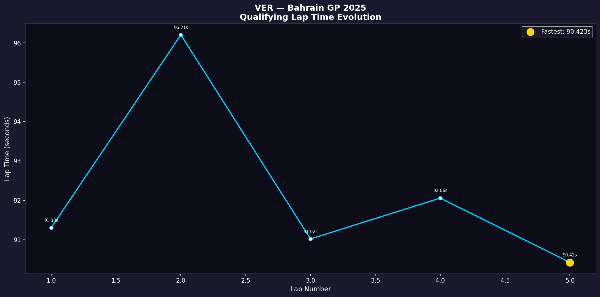

# 🏎️ F1 Telemetry Analytics

A modular Python pipeline for race engineer-level analysis of Formula 1 telemetry data, built on the `fastf1` library with official F1 timing feeds.

Designed around a core research question: **where, precisely, does lap time delta between top competitors originate?** — quantified at the sensor level across speed, throttle, brake, and gear traces.

---

## 📁 Project Structure

f1_telemetry/

├── config.py          # Session params, driver config, color constants

├── loader.py          # Session loading, caching, quicklap selection

└── viz/

└── lap_evolution.py   # Qualifying lap time evolution plot

main.py                # Entry point

---

## 📊 Visualizations

### 1. Fastest Lap Telemetry — Max Verstappen, Bahrain GP 2025 Qualifying
Speed, throttle, brake, and gear traces across the full 5.4km lap.


### 2. Track Map Colored by Speed — Bahrain International Circuit
Circuit layout with speed heatmap. Purple = slow corners (~80 km/h), Yellow = full throttle straights (~310 km/h).


### 3. Qualifying Lap Time Evolution — Verstappen
Lap-by-lap progression across the qualifying session, with fastest lap highlighted.



### 4. Head-to-Head Driver Comparison — VER vs NOR
Overlaid telemetry (speed, throttle, brake, gear) with cumulative time delta panel showing exactly where each driver gains or loses time.


---

## 🔍 Key Findings

### Driver Delta — VER vs NOR
- VER leads in Sector 1 (0–1000m) by up to +0.25s — stronger T1 braking commitment
- NOR recovers and dominates Sector 2 (1500–3500m) by up to -0.85s — superior infield throttle application
- Gap narrows in Sector 3, NOR finishes 0.6s ahead overall on this lap comparison

### Braking Zone Characterisation — VER Fastest Lap
| Zone | Distance (m) | Entry (kph) | Exit (kph) | Scrubbed (kph) | Braking Dist (m) |
|------|-------------|-------------|------------|----------------|-----------------|
| Z1 | 619 | 265 | 71 | 193.9 | 93.8 |
| Z2 | 1382 | 295 | 138 | 156.9 | 98.5 |
| Z3 | 1786 | 255 | 216 | 38.5 | 58.3 |
| Z4 | 2109 | 258 | 90 | 168.0 | 90.1 |
| Z5 | 2540 | 260 | 88 | 171.5 | 131.3 |
| Z6 | 3292 | 308 | 167 | 140.8 | 102.5 |
| Z7 | 3977 | 229 | 140 | 88.9 | 83.3 |
| Z8 | 4764 | 265 | 137 | 128.0 | 73.0 |

- **Hardest stop:** Z1 — 193.9 kph scrubbed in 93.8m (peak decel proxy: 2.07)
- **Longest brake:** Z5 — 131.3m at ~2540m circuit distance
- **Highest entry speed:** Z6 — 308 kph into the back straight hairpin
- **Lightest touch:** Z3 — only 38.5 kph scrubbed, chicane transition
---

## 🛠️ Tech Stack

| Tool | Purpose |
|---|---|
| `fastf1` | Official F1 timing & telemetry data |
| `matplotlib` | Visualization |
| `pandas` | Data manipulation |
| `numpy` | Numerical processing |

---

## 🚀 Run It Yourself

```bash
pip install fastf1 matplotlib pandas numpy
python main.py
```

Session data is cached locally in `f1_cache/` on first run. Subsequent runs are near-instant.

To change race, session, or drivers — edit `f1_telemetry/config.py`:

```python
SESSION_CONFIG = {"year": 2025, "gp": "Bahrain", "session": "Q"}
DRIVERS = {"primary": "VER", "comparison": "NOR"}
```

---

## 🔬 Roadmap

- [x] Fastest lap telemetry traces
- [x] Speed-colored track map
- [x] Qualifying lap evolution
- [x] Head-to-head telemetry overlay with time delta
- [ ] Braking zone extractor — detect and characterize braking events per corner
- [ ] Micro-sector dominance map — 50m segment analysis
- [ ] Tyre degradation model — stint lap time curve fitting
- [ ] Q1/Q2/Q3 evolution across all drivers
- [ ] Multi-race championship trend analysis

---

*Data sourced via fastf1 from official F1 timing feeds.*  
*Built by Sehaj Modi — Instrumentation & Control Engineering, NIT Jalandhar*