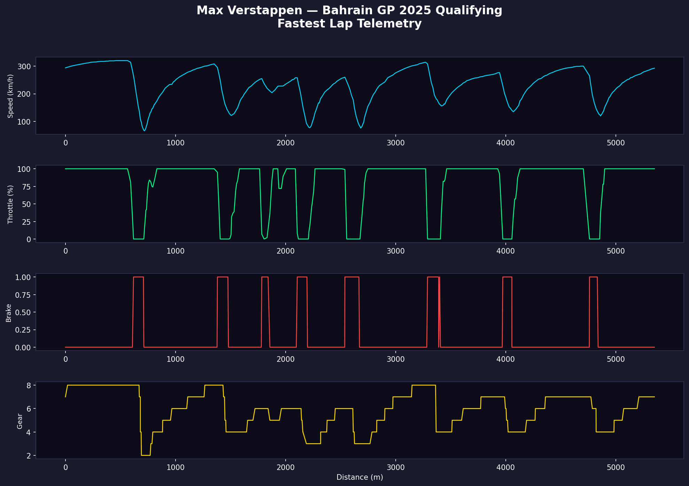
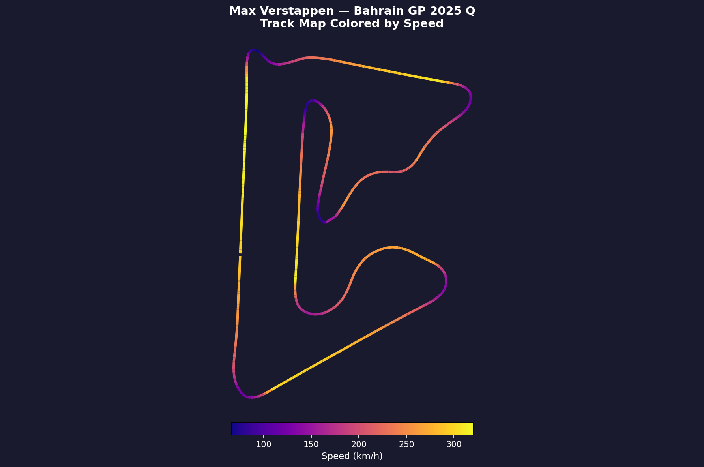
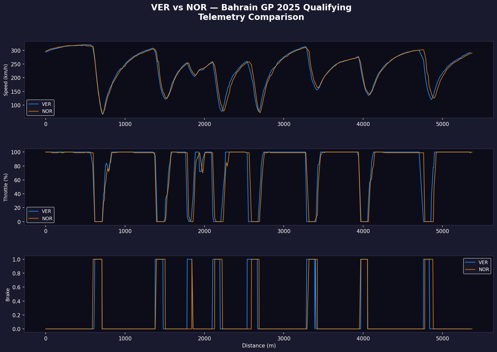

# 🏎️ F1 Telemetry Analysis

Real-world Formula 1 telemetry data analysis using Python and the `fastf1` library — pulling directly from official F1 timing feeds.

Built to explore driver performance, braking zones, throttle traces, and track geometry at a data level.

---

## 📊 Visualizations

### 1. Fastest Lap Telemetry — Max Verstappen, Bahrain GP 2025 Qualifying
Speed, throttle, brake, and gear traces across the full 5.4km lap.



### 2. Track Map Colored by Speed — Bahrain International Circuit
Circuit layout with speed heatmap. Purple = slow corners (~80 km/h), Yellow = full throttle straights (~310 km/h).



### 3. Driver Comparison — VER vs NOR, Bahrain GP 2025 Qualifying
Overlaid telemetry showing exactly where each driver gains or loses time.



---

## 🔍 Key Insights

- VER and NOR are nearly identical through braking zones — the gap comes from micro-throttle application in the infield
- Turn 1 (~600m): hardest braking point on the circuit, 300 → 80 km/h in under 100m
- Sector 2 infield (~2000–2800m): most differentiation between the two drivers

---

## 🛠️ Tech Stack

| Tool | Purpose |
|------|---------|
| `fastf1` | Official F1 timing & telemetry data |
| `matplotlib` | Visualization |
| `pandas` | Data manipulation |
| `numpy` | Numerical processing |

---

## 🚀 Run It Yourself

```bash
pip install fastf1 matplotlib pandas numpy
mkdir f1_cache
python f1_analysis.py
```

---

## 🔮 What's Next

- [ ] Sector time delta analysis — where exactly is time lost/gained per corner
- [ ] Tyre degradation modeling across race stints  
- [ ] Interactive dashboard using Plotly/Dash
- [ ] Multi-race championship trend analysis
- [ ] Qualifying lap evolution — how each driver improved across Q1/Q2/Q3

---

*Data sourced via fastf1 from official F1 timing feeds.*  
*Built by Sehaj Modi — Instrumentation & Control Engineering @ NIT Jalandhar*