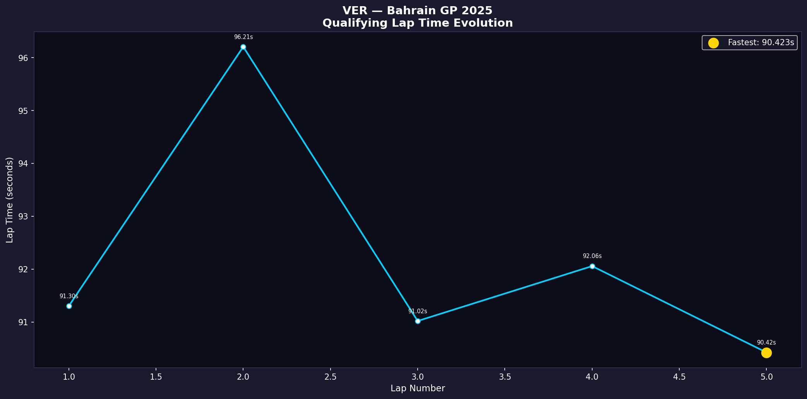
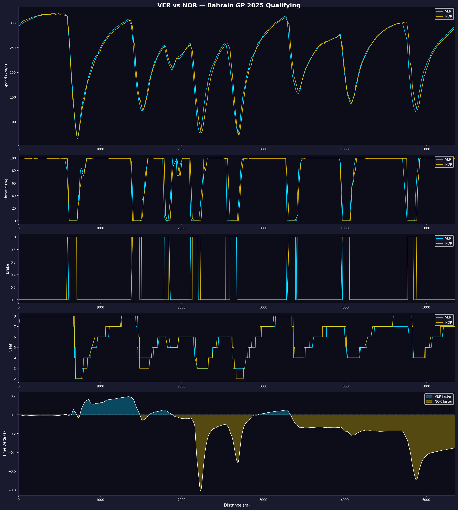
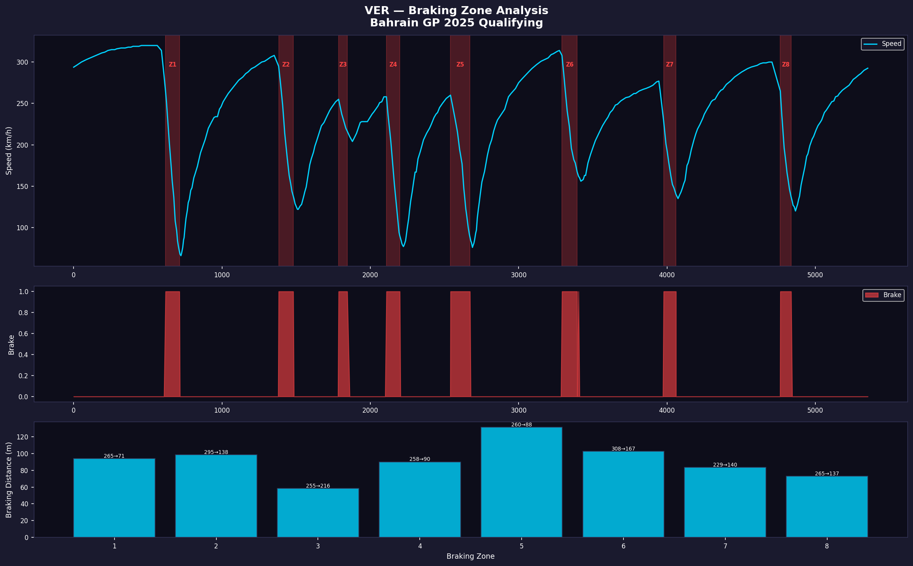
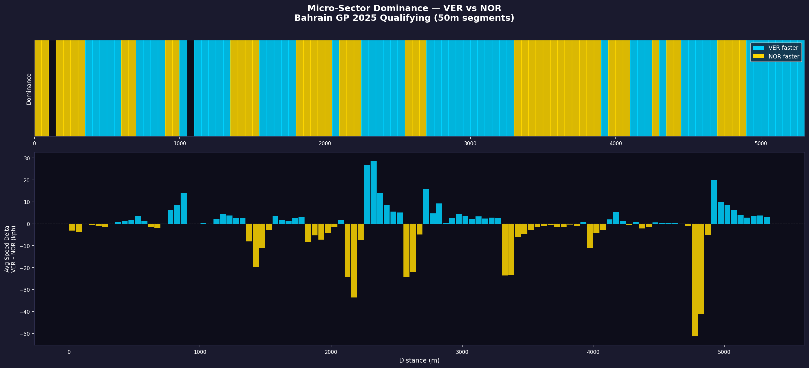
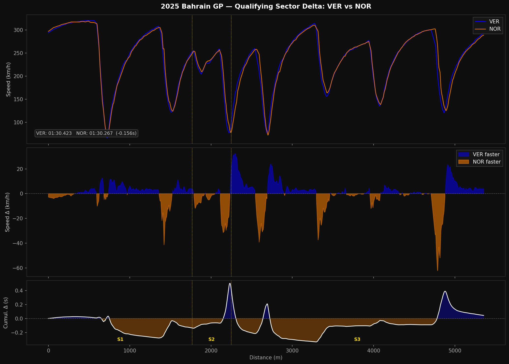
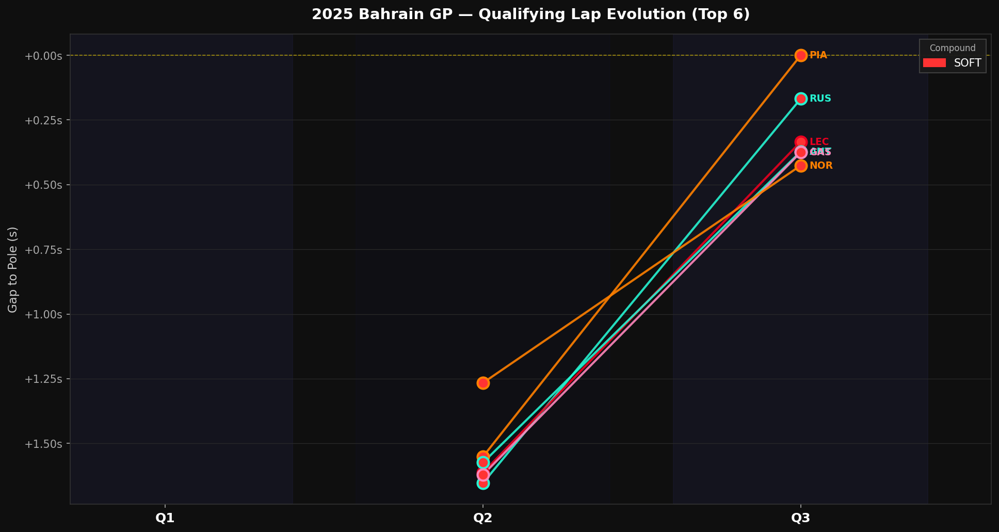
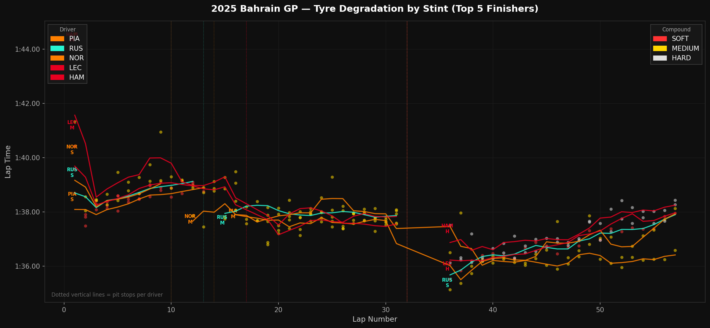

# 🏎️ F1 Telemetry Analytics

A modular Python pipeline for race engineer-level analysis of Formula 1 telemetry data, built on the `fastf1` library with official F1 timing feeds.

Designed around a core research question: **where, precisely, does lap time delta between top competitors originate?** — quantified at the sensor level across speed, throttle, brake, gear traces, tyre compounds, and qualifying session progression.

---

## 📁 Project Structure

```
F1-TELEMETRY-ANALYTICS/
├── f1_telemetry/
│   ├── config.py              # Session params, driver config, color constants
│   ├── loader.py              # Session loading, caching, quicklap selection
│   ├── analysis/
│   │   ├── sector_delta.py    # Sector-by-sector speed & cumulative time delta
│   │   ├── quali_evolution.py # Q1 → Q2 → Q3 lap time progression (top 6)
│   │   └── tyre_deg.py        # Tyre degradation by stint with pit stop markers
│   └── viz/
│       └── lap_evolution.py   # Qualifying lap time evolution plot
├── outputs/                   # All generated plots saved here
├── f1_cache/                  # FastF1 local cache (auto-created)
└── main.py                    # Entry point
```

---

## 📊 Visualizations

### 1. Qualifying Lap Time Evolution — Verstappen
Lap-by-lap progression across the qualifying session, fastest lap highlighted.



---

### 2. Head-to-Head Telemetry — VER vs NOR
Overlaid speed, throttle, brake, and gear traces with cumulative time delta panel.



---

### 3. Braking Zone Analysis — Verstappen
Auto-detected braking events with entry/exit speed, braking distance, and decel proxy per corner.



---

### 4. Micro-Sector Dominance Map — VER vs NOR
Lap split into 105 segments of 50m. Each segment coloured by which driver held higher average speed.



---

### 5. Sector Time Delta — VER vs NOR *(new)*
Three-panel plot: speed traces, speed delta (coloured by who leads), and cumulative time delta across the lap — with sector split markers. Shows the exact corners where time is gained or lost.

> **Finding:** NOR takes pole by 0.156s. VER is competitive in S1 but NOR opens a decisive gap through the S2 infield complex — concentrated in two braking zones where NOR carries significantly more minimum speed.



---

### 6. Qualifying Lap Evolution — Q1 → Q2 → Q3 *(new)*
Gap-to-pole for the top 6 drivers across all three qualifying segments, coloured by compound. Shows how each driver improves through the session and who peaks latest.

> **Finding:** PIA takes pole on SOFT compound. The field converges sharply from Q2 → Q3, with most drivers within 0.4s. NOR and LEC improve the most between segments; RUS maintains consistent pace across all three.



---

### 7. Tyre Degradation by Stint — Race *(new)*
Lap time vs lap number for the top 5 finishers, split by stint and coloured by compound. Pit stop laps shown as vertical dashed lines. Rolling average trend line per driver per stint.

> **Finding:** NOR (orange) runs a contrasting two-stop strategy versus the field. Hard compound stints in the final phase show clear lap time advantages for drivers who undercut on fresher rubber. LEC's MEDIUM degradation is the steepest among the front-runners.



---

## 🔍 Key Findings

### Driver Delta — VER vs NOR, Bahrain GP 2025 Qualifying
- VER leads Sector 1 (0–1000m) by up to +0.25s — stronger T1 braking commitment
- NOR dominates Sector 2 (1500–3500m) by up to -0.85s — superior infield throttle application
- NOR takes pole by 0.156s; gap is recovered and re-lost across S3

### Micro-Sector Dominance (105 × 50m segments)
| Driver | Segments Won | Share | Max Speed Advantage |
|--------|-------------|-------|-------------------|
| VER | 58 | 55.2% | +28.66 kph |
| NOR | 47 | 44.8% | +51.33 kph |

VER wins more segments overall but NOR's advantages are larger in magnitude — concentrated in braking zones where NOR scrubs significantly more speed.

### Braking Zone Characterisation — VER Fastest Lap (90.42s)
| Zone | Dist (m) | Entry (kph) | Exit (kph) | Scrubbed (kph) | Braking Dist (m) |
|------|----------|-------------|------------|----------------|-----------------|
| Z1 | 619 | 265 | 71 | 193.9 | 93.8 |
| Z2 | 1382 | 295 | 138 | 156.9 | 98.5 |
| Z3 | 1786 | 255 | 216 | 38.5 | 58.3 |
| Z4 | 2109 | 258 | 90 | 168.0 | 90.1 |
| Z5 | 2540 | 260 | 88 | 171.5 | 131.3 |
| Z6 | 3292 | 308 | 167 | 140.8 | 102.5 |
| Z7 | 3977 | 229 | 140 | 88.9 | 83.3 |
| Z8 | 4764 | 265 | 137 | 128.0 | 73.0 |

- **Hardest stop:** Z1 — 193.9 kph scrubbed in 93.8m (decel proxy: 2.07)
- **Longest brake:** Z5 — 131.3m at ~2540m
- **Highest entry:** Z6 — 308 kph into the back straight hairpin
- **Lightest touch:** Z3 — 38.5 kph scrubbed, chicane transition

---

## 🛠️ Tech Stack

| Tool | Purpose |
|------|---------|
| `fastf1` | Official F1 timing & telemetry data |
| `matplotlib` | Visualization |
| `pandas` | Data manipulation |
| `numpy` | Numerical processing |

---

## 🚀 Run It Yourself

```bash
pip install fastf1 matplotlib pandas numpy
python main.py
```

Session data is cached locally in `f1_cache/` on first run. Subsequent runs are near-instant.

To change race, session, or drivers — edit `f1_telemetry/config.py`:

```python
SESSION_CONFIG = {"year": 2025, "gp": "Bahrain", "session": "Q"}
DRIVERS = {"primary": "VER", "comparison": "NOR"}
```

Run individual analyses:

```bash
python f1_telemetry/analysis/sector_delta.py
python f1_telemetry/analysis/quali_evolution.py
python f1_telemetry/analysis/tyre_deg.py
```

---

## 🔬 Roadmap

- [x] Fastest lap telemetry traces
- [x] Speed-colored track map
- [x] Qualifying lap time evolution
- [x] Head-to-head telemetry overlay with time delta
- [x] Braking zone extractor — auto-detection with entry/exit speed characterization
- [x] Micro-sector dominance map — 50m segment analysis
- [x] Sector time delta — cumulative gap panel with sector split markers
- [x] Q1/Q2/Q3 qualifying evolution across top drivers
- [x] Tyre degradation by stint — compound-coloured lap time curves
- [ ] ESP32 hardware integration — live sensor data ingestion
- [ ] Multi-race championship trend analysis
- [ ] Pit stop window optimiser — undercut/overcut modelling

---

*Data sourced via fastf1 from official F1 timing feeds.*  
*Built by Sehaj Modi — Instrumentation & Control Engineering, NIT Jalandhar*